# Txing AI

<div align="center"> 

  <h1>Txing AI</h1>
  <p>🤖 智能对话平台 | 多模型支持 | 智能负载均衡</p>

  [](https://go.dev/)
  [](https://vuejs.org/)
  [](https://element-plus.org/)
  [](LICENSE)
  [](CONTRIBUTING.md)

  [📚 文档](docs/README.md) |
  [🚀 快速开始](#快速开始) |
  [👥 贡献](#贡献指南) |
  [📝 更新日志](CHANGELOG.md)

---

  
  [](https://github.com/lemon-puls/txing-ai/stargazers)
  [](https://github.com/lemon-puls/txing-ai/network/members)
  [](https://github.com/lemon-puls/txing-ai/issues)
  [](https://github.com/lemon-puls/txing-ai/pulls)
</div>

---

Txing AI 是一个现代化的 AI 聊天平台，基于 Vue 3 和 Go 开发，支持多模型接入和智能会话管理。平台采用前后端分离架构，提供流畅的用户体验和强大的后台管理功能。

**核心优势**：支持 OpenAI、火山引擎、Polo 等多个 AI 服务商统一接入，具备智能负载均衡、WebSocket 实时通信、JWT 安全认证、模块化可扩展架构等企业级特性，为用户提供高性能、安全可靠的 AI 对话服务。

## 🌟 功能特点

### 👥 用户端功能

| 功能模块 | 子功能 | 状态 | 说明 |
|---------|--------|------|------|
| **多模型支持** | 多种大语言模型接入 | ✅ 已实现 | 支持 DeepSeek、ChatGPT 等 |
| | 模型市场自由选择 | ✅ 已实现 | 自由指定对话模型 |
| | 实时对话流式响应 | ✅ 已实现 | 打字机效果，WebSocket 通信 |
| | 智能上下文管理 | ✅ 已实现 | 支持多轮对话 |
| | 网页搜索增强 | ✅ 已实现 | 当前仅有部分模型支持联网搜索 |
| **预设系统** | 自定义 AI 助手角色 | ✅ 已实现 | 支持角色背景、性格特征设定 |
| | 预设市场一键使用 | ✅ 已实现 | 支持按场景分类 |
| | 个性化对话场景定制 | ✅ 已实现 | 完整的预设管理功能 |
| | 预设评分和收藏系统 | 📋 待开发 | 后续版本规划 |
| **会话管理** | 多会话并行支持 | ✅ 已实现 | 快速切换，实时保存 |
| | 历史记录完整保存 | ✅ 已实现 | 支持查看和导出 |
| | 会话导出备份 | ✅ 已实现 | 支持多种格式 |

### 👨‍💼 管理端功能

| 功能模块 | 子功能 | 状态 | 说明 |
|---------|--------|------|------|
| **渠道管理** | 多渠道统一管理 | ✅ 已实现 | 支持多个供应商 |
| | 智能负载均衡策略 | 🔄 开发中 | 优先级控制、权重分配，当前后端还是随机选择使用 |
| | 自动故障转移 | ✅ 已实现 | 故障自动切换 |
| | 模型组合配置 | ✅ 已实现 | 一个渠道支持多个模型 |
| | 实时状态监控 | ✅ 已实现 | 调用量、响应时间、错误率统计 |
| **预设管理** | 分类标签管理系统 | ✅ 已实现 | 支持分类和标签 |
| | 热门推荐设置 | 📋 待开发 | 后续版本规划 |
| | 预设排行榜 | 📋 待开发 | 后续版本规划 |
| **用户管理** | 用户权限分级控制 | ✅ 已实现 | 目前实现了简单的权限分级管理 |
| | 使用量统计分析 | 📋 待开发 | 对话 token 消耗、调用次数、使用时长等统计，后续版本规划 |
| | 费用统计 | 📋 待开发 | 后续版本规划 |
| | 账户状态管理 | ✅ 已实现 | 启用/禁用用户 |
| **模型市场** | 基础管理 | ✅ 已实现 | 基础的 CRUD |
| | 价格策略设置 | 📋 待开发 | 按次计费、按 Token 计费 |
| | 使用量统计 | 📋 待开发 | 基础统计功能 |
| | 评分反馈系统 | 📋 待开发 | 后续版本规划 |
| **控制台** | 各种数据统计和监控 | 📋 待开发 | 通过可视化仪表监控各种数据 |


## 🏗️ 系统设计

### 📐 系统架构图

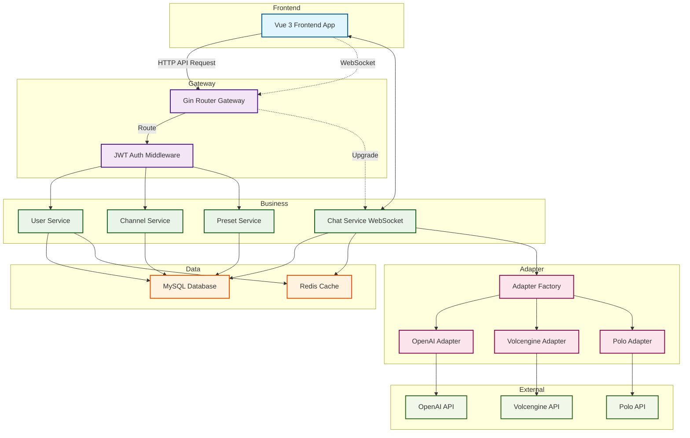

### 🔗 核心组件关系图

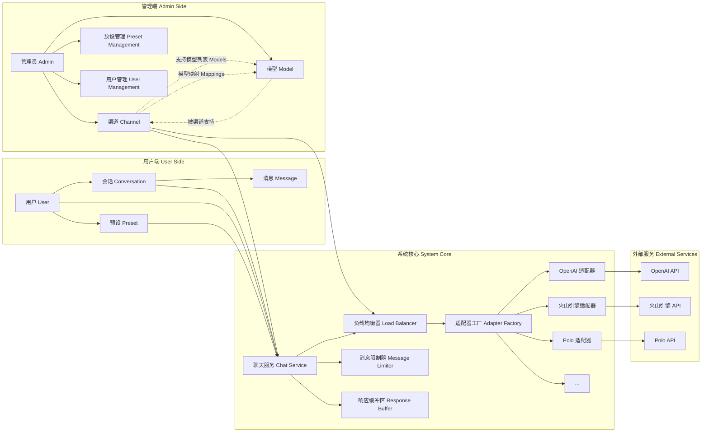

### 💬 聊天请求处理流程图

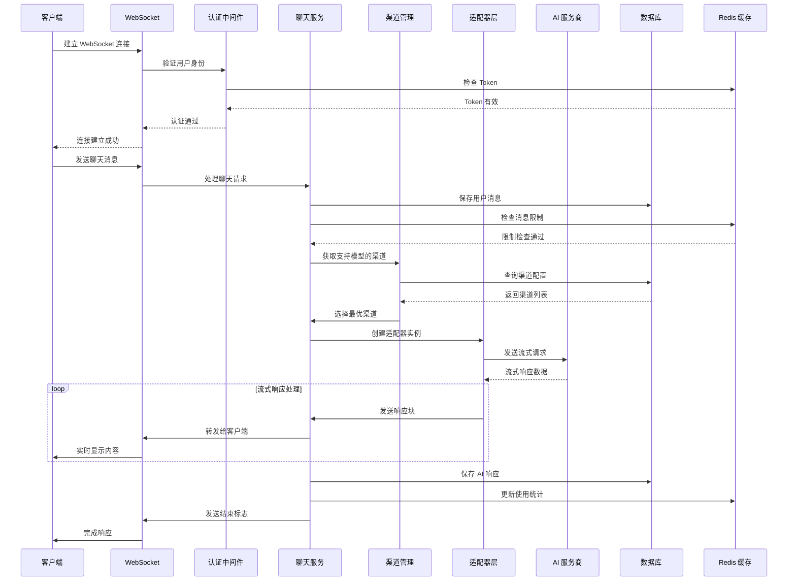

### 🎯 核心概念说明

#### 🔗 Channel（渠道）
- **定义**: 连接不同 AI 服务商的抽象层
- **功能**: 
  - 统一管理多个 AI 服务商
  - 支持优先级和权重配置
  - 实现智能负载均衡
  - 提供故障转移机制
- **配置项**:
  - `name`: 渠道名称
  - `type`: 渠道类型（OpenAI、火山引擎、Polo等），注意，不同的服务供应商也可以使用相同的渠道 channel 类型，例如阿里云的通义千问支持 OpenAI 访问格式，所以也可以定义为  OpenAI 类型。
  - `priority`: 优先级（1-100）
  - `weight`: 权重分配
  - `models`: 支持的模型列表
  - `mappings`: 模型映射关系
  - `endpoint`: 服务地址
  - `secret`: API 密钥

#### 🤖 Model（模型）
- **定义**: AI 模型的具体实现
- **功能**:
  - 定义模型的基本信息
  - 支持模型标签分类
  - 配置模型特性（高上下文、默认模型等）
- **配置项**:
  - `name`: 模型名称
  - `description`: 模型描述
  - `default`: 是否为默认模型
  - `high_context`: 是否支持高上下文
  - `avatar`: 模型头像
  - `tag`: 模型标签

#### 🔄 Channel-Model 关系
- **多对多关系**: 一个渠道可以支持多个模型，一个模型可以被多个渠道支持
- **模型映射**: 渠道可以配置模型映射规则，根据条件动态选择具体的模型版本
- **负载均衡**: 系统根据渠道的优先级和权重，智能选择最优渠道处理请求

#### 🎭 Preset（预设）
- **定义**: AI 助手的角色配置
- **功能**:
  - 定义 AI 助手的性格特征
  - 设置对话上下文
  - 提供场景化对话
- **属性**:
  - `name`: 预设名称
  - `description`: 预设描述
  - `context`: 系统提示词
  - `avatar`: 预设头像
  - `tags`: 标签分类

#### 💬 Conversation（会话）
- **定义**: 用户与 AI 的对话实例
- **功能**:
  - 管理对话历史
  - 保存消息记录
  - 维护对话上下文
- **属性**:
  - `name`: 会话标题
  - `model`: 使用的模型
  - `messages`: 消息历史
  - `presetId`: 关联的预设

### 🔄 负载均衡策略

#### 优先级策略
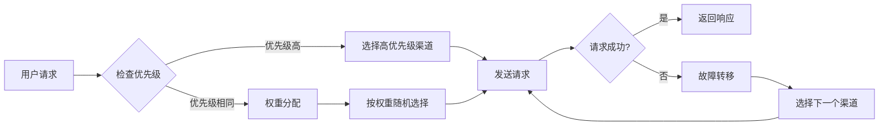

#### 权重分配算法
```javascript
// 权重分配示例
const channels = [
  { name: 'Channel A', weight: 60, priority: 100 },
  { name: 'Channel B', weight: 30, priority: 100 },
  { name: 'Channel C', weight: 10, priority: 100 }
];

// 60% 的请求会路由到 Channel A
// 30% 的请求会路由到 Channel B  
// 10% 的请求会路由到 Channel C
```

### 🔄 模型映射机制

#### 模型映射流程图
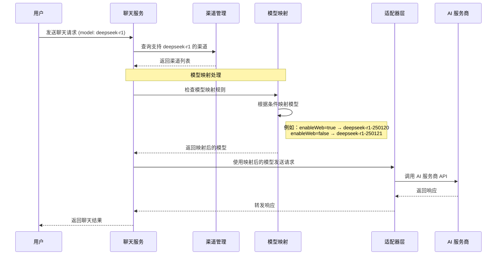

#### 模型映射配置示例
```json
{
  "sourceModel": "deepseek-r1",
  "conditions": [
    {
      "targetModel": "deepseek-r1-250120",
      "conditions": {
        "enableWeb": true
      }
    },
    {
      "targetModel": "deepseek-r1-250121", 
      "conditions": {
        "enableWeb": false
      }
    }
  ]
}
```

#### 映射规则说明
- **源模型**: 用户请求的模型名称
- **目标模型**: 实际发送给 AI 服务商的模型名称
- **条件映射**: 根据请求参数动态选择目标模型
- **默认映射**: 如果没有匹配的条件，使用源模型作为目标模型

### 🛡️ 安全机制

#### 认证授权流程
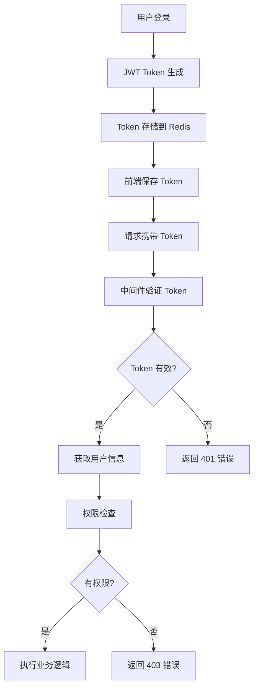

#### 消息限制机制
- **每日消息限制**: 防止滥用
- **用户等级限制**: 不同用户等级有不同的限制
- **实时监控**: 实时统计和告警
- **自动恢复**: 每日零点自动重置限制

## 🔧 技术架构

### 🎨 前端技术栈

| 技术 | 版本 | 说明 |
|------|------|------|
| **Vue.js** | 3.x | 渐进式 JavaScript 框架，使用 Composition API |
| **Element Plus** | Latest | 基于 Vue 3 的组件库，提供美观的 UI 组件 |
| **Vite** | Latest | 下一代前端构建工具，提供快速的开发体验 |
| **Pinia** | Latest | Vue 3 的状态管理库，替代 Vuex |
| **Vue Router** | 4.x | Vue.js 官方路由管理器 |
| **Axios** | Latest | 基于 Promise 的 HTTP 客户端 |
| **WebSocket** | Native | 实时通信协议，支持流式响应 |
| **OpenAPI Generator** | Latest | 自动生成 TypeScript API 客户端代码 |

### ⚙️ 后端技术栈

| 技术 | 版本 | 说明 |
|------|------|------|
| **Go** | 1.23+ | 高性能编程语言，支持高并发处理 |
| **Gin** | Latest | 高性能 HTTP Web 框架 |
| **GORM** | Latest | Go 语言的 ORM 库，简化数据库操作 |
| **Redis** | 6.0+ | 高性能缓存数据库 |
| **MySQL** | 5.7+ | 关系型数据库，存储业务数据 |
| **Zap** | Latest | 高性能结构化日志库 |
| **Viper** | Latest | 配置管理库，支持多种配置格式 |
| **Swagger** | Latest | API 文档自动生成工具 |

## 🚀 快速开始

### 环境要求

- Go 1.23+
- MySQL 5.7+
- Redis 6.0+
- Node.js 18+
- pnpm 8.0+

### 克隆代码

```bash
git clone git@github.com:lemon-puls/txing-ai.git
cd txing-ai
```

### 配置及启动

1. 配置数据库
```bash
# 创建配置文件
cp config.toml.sample runtime/config.toml
# 根据实际情况修改配置
```

2. 生成 API 文档
```bash
swag init -g cmd/main.go
```

3. 前端项目初始化
```bash
# 进入前端目录下
cd static/frontend
# 安装依赖
npm install
# 项目打包
npm run build
```
> 注意：前端部分的打包生成目录 dist 会在 GO 项目中嵌入作为静态资源对外提供服务，所以不需单独启动前端项目。

4. 启动服务
   启动时会自动执行数据库迁移，生成表，无需手动创建。
```bash
go run cmd/main.go
```
5. 访问地址

   项目启动后会打印出 swgger 和网站的访问地址。

## 📚 项目结构

```
├── cmd                 # 主程序入口
├── internal           # 内部包
│   ├── app           # 应用生命周期
│   ├── controller    # 控制器
│   ├── middleware    # 中间件
│   ├── domain        # 数据库实体
│   ├── dto           # 数据传输对象
│   ├── vo            # 视图对象
│   ├── enum          # 枚举
│   ├── global        # 公共包
│   ├── iface         # 接口定义
│   ├── service      # 业务服务
│   ├── route         # 路由
│   └── utils        # 工具函数
├── runtime           # 运行时文件（日志、配置文件等）
├── scripts          # 脚本工具
└── static/frontend              # 前端项目
    ├── src
    │   ├── api     # API 接口
    │   ├── assets  # 静态资源
    │   ├── components # 组件
    │   ├── layouts   # 布局
    │   ├── router    # 路由
    │   ├── stores    # 状态管理
    │   └── views     # 页面
    └── public      # 公共资源
```

## 开发说明
### SVG 图标使用
项目封装了 SvgIcon 组件，可以直接使用，主要支持配置项：
- `icon`：图标名称，必填
- `size`：图标大小，默认 16px
- `color`：图标颜色
- `click`：是否开启点击动画，默认 false
- `class`：自定义类名
- `spin`：是否开启旋转动画，默认 false
- `rotate`：旋转角度（顺时针），默认 0
- `hover`: 是否开启鼠标悬停动画，默认 false

使用示例：
```vue
<SvgIcon icon="theme" size="20" color="#1890ff" click/>
```

### 前端权限指令使用

```js

// 权限指令
// Permission directive

// 使用方式 Usage:
v-permission:role="['admin', 'editor']"  // 角色权限 Role permission

v-permission:perm="['create', 'edit']"   // 操作权限 Permission-based

v-permission:role.hide="['admin']"       // 无权限时隐藏元素 Hide when no permission

v-permission:perm.hide="['create']"      // 无权限时隐藏元素 Hide when no permission
```

在需要进行前端权限的元素上添加 v-permission 指令即可，实例如下：

```js
<el-button v-permission:role.hide="['admin']" type="primary" circle class="new-chat-button" @click="createNewChat('')">
    <el-icon>
         <Plus class="icon-bounce"/>
    </el-icon>
</el-button>
```
### 前后端开发对接方式

本项目接入了 OpenAPI Generator 库用于直接根据后端接口文档生成 api 客户端代码，极大程度上方便了在前端业务代码中对接口的调用。开发步骤如下：

1. 后端接口完成修改后，使用 swag init 命令重新生成接口文档，然后启动后端

2. 在前端运行以下命令生成 api 客户端代码，生成的代码在 src/api/generated 目录下

    ```bash
    npm run generate-api
    ```

3. 在前端业务代码中要调用后端接口只需调用上一步生成代码的对应方法即可，示例如下：

   ```js
       const response = await defaultApi.apiAdminChannelListGet(
         currentPage.value,
         pageSize.value,
         {
           orderBy: 'id',
           order: 'desc',
           type: searchForm.value.type || undefined,
           name: searchForm.value.name || undefined
         }
       )
   ```

   ​

## 🎉 展示

### 🏠 首页
<div align="center">
  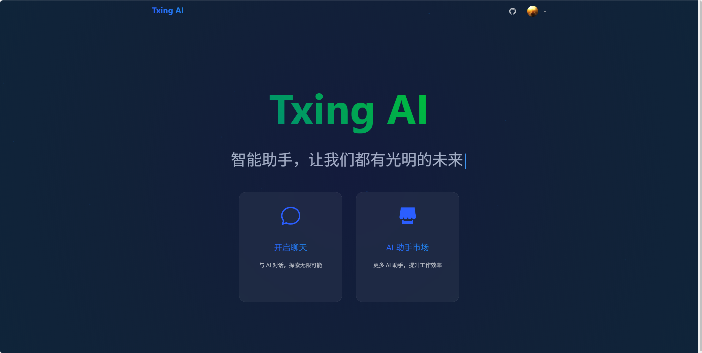
  <p><em>现代化的首页设计，展示平台核心功能和特色</em></p>
</div>

### 💬 AI 聊天功能
<div align="center">
  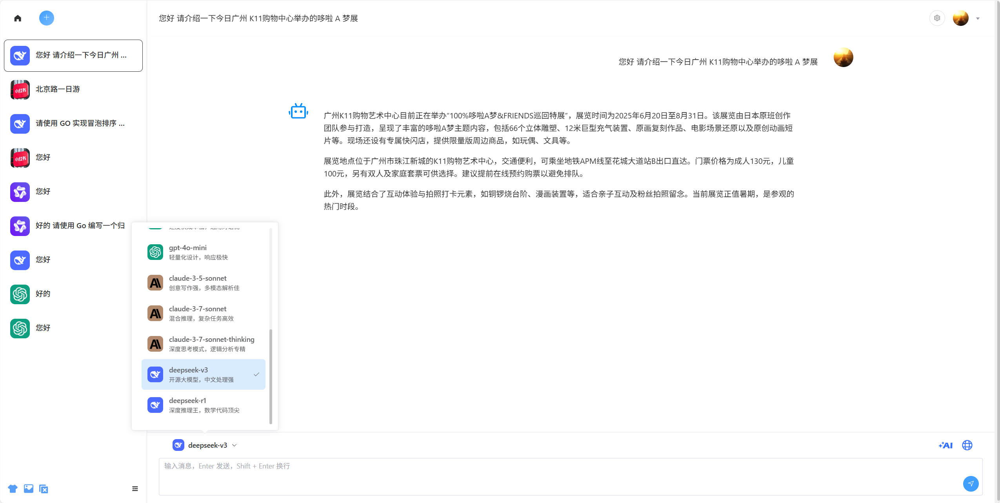
  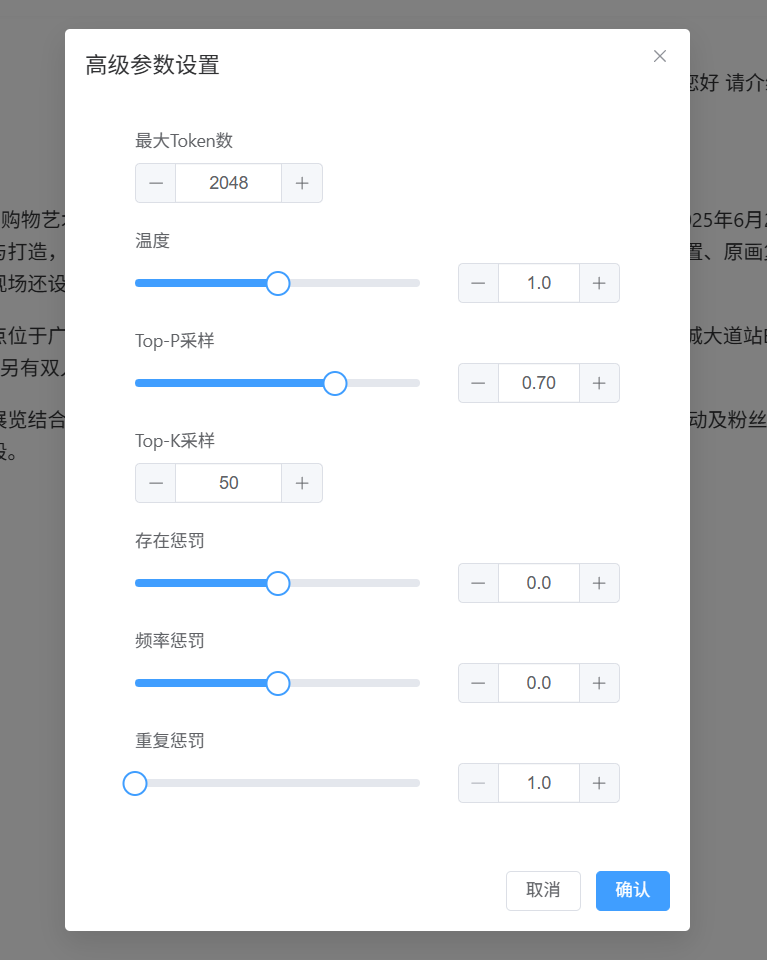
  <p><em>智能对话界面，支持多模型切换和参数自定义</em></p>
</div>

### 🤖 AI 助手预设
<div align="center">
  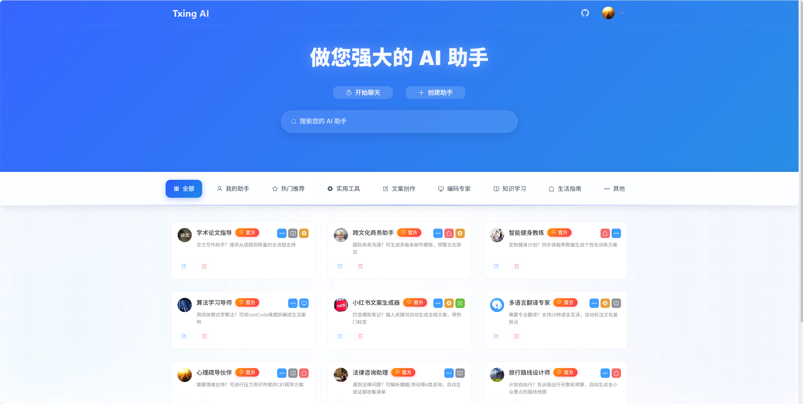
  <p><em>丰富的 AI 助手预设市场，支持角色定制和场景应用</em></p>
</div>

### 👨‍💼 后台管理系统

#### 📊 控制台
<div align="center">
  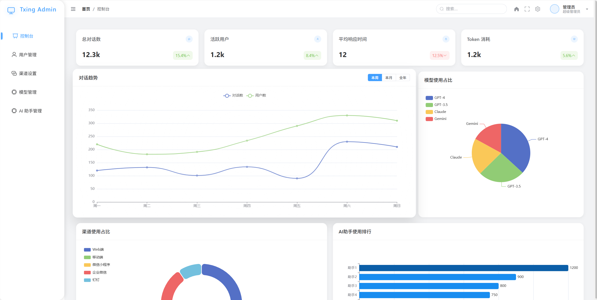
  <p><em>数据统计仪表板，实时监控平台运营状态</em></p>
</div>

#### 👥 用户管理
<div align="center">
  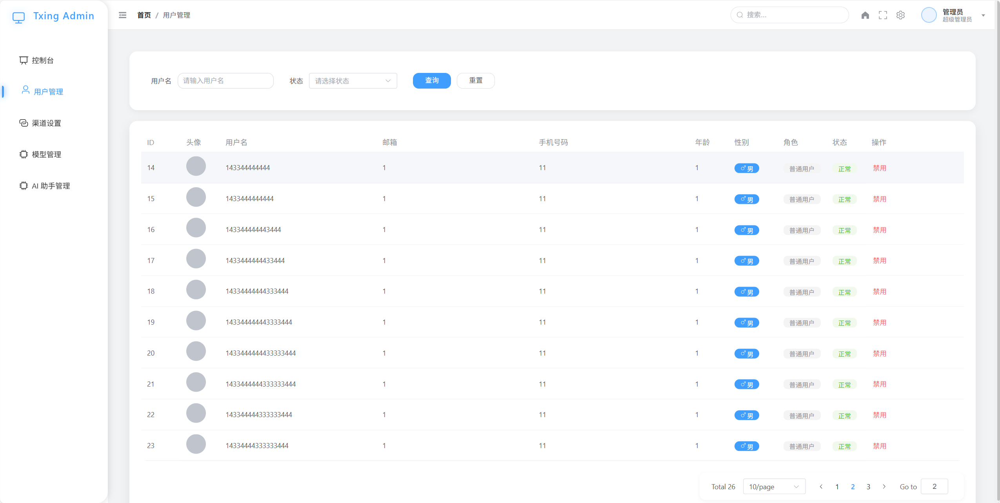
  <p><em>用户权限管理，支持角色分配和状态控制</em></p>
</div>

#### 🔗 渠道管理
<div align="center">
  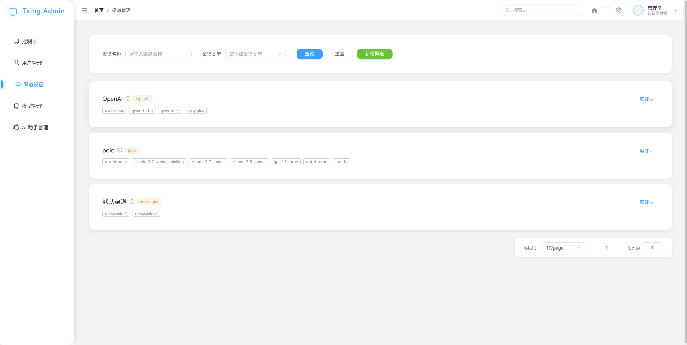
  <p><em>多渠道配置管理，支持负载均衡和故障转移</em></p>
</div>

#### 🤖 模型管理
<div align="center">
  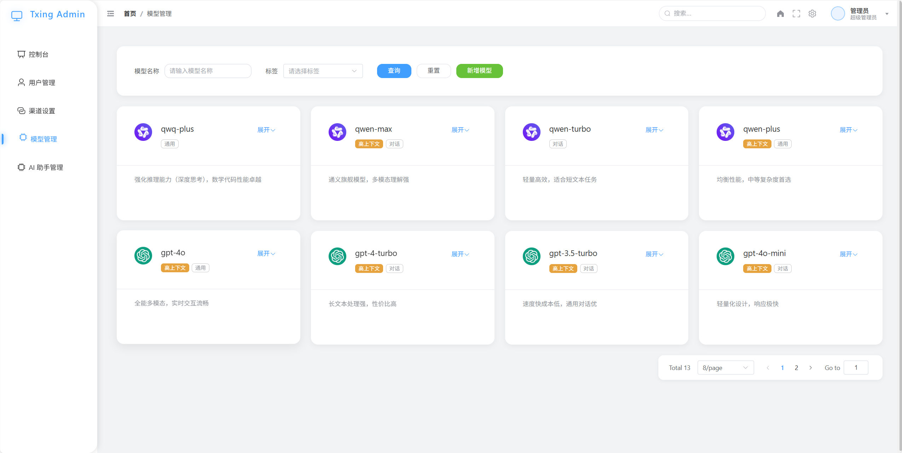
  <p><em>模型市场管理，支持模型上架和价格策略配置</em></p>
</div>

#### 🎯 AI 助手管理
<div align="center">
  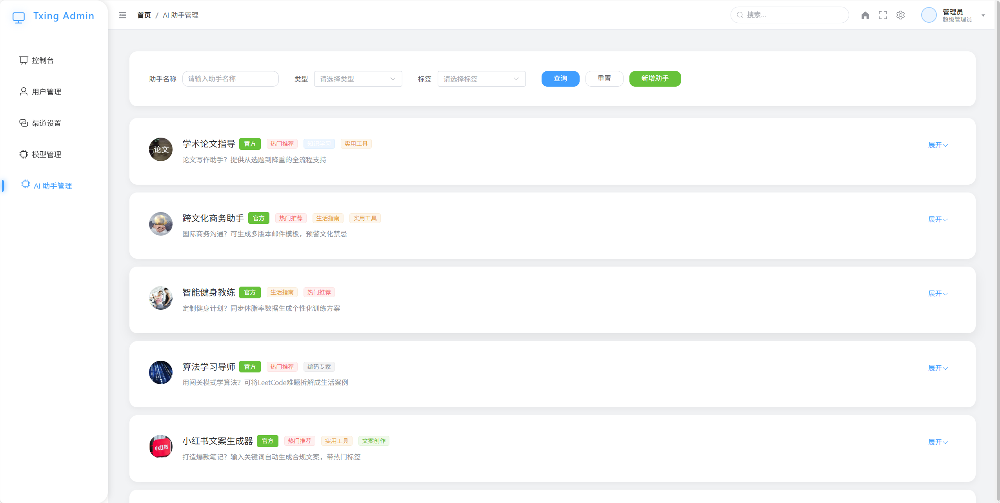
  <p><em>预设内容管理，支持审核发布和分类管理</em></p>
</div>

## 🤝 贡献指南

1. Fork 本仓库
2. 创建特性分支 (`git checkout -b feat/AmazingFeature`)
3. 提交更改 (`git commit -m 'Add some AmazingFeature'`)
4. 推送到分支 (`git push origin feat/AmazingFeature`)
5. 提交 Pull Request

## 📄 许可证

本项目采用 MIT 许可证

---

<div align="center">
  <sub>Built with ❤️ by The Txing AI</sub>
</div>